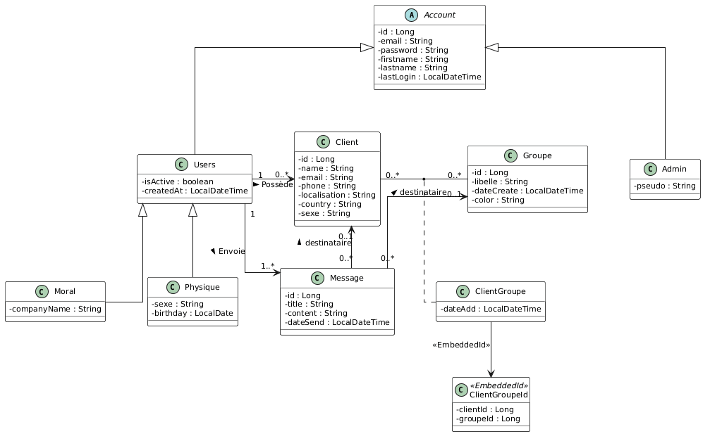
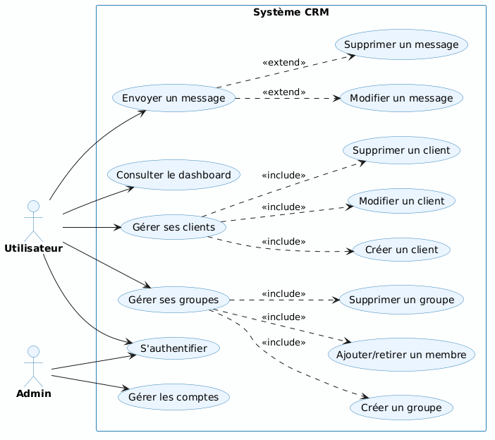

# CRM — Backend JAX-RS + JPA

Application CRM (Customer Relationship Management) développée dans le cadre du module **SIR** — Master SIR, ISTIC 2025/2026.

**Auteurs :** Yann Mendel Konan, Esaie Omiyale

---

## Stack technique

| Couche             | Technologie                          |
|--------------------|--------------------------------------|
| Langage            | Java 17                              |
| API REST           | JAX-RS (RESTEasy)                    |
| Serveur            | Undertow (embarqué, port 8080)       |
| ORM                | JPA / Hibernate                      |
| Base (défaut)      | HSQLDB — unité `dev`                 |
| Base (alternative) | PostgreSQL — unité `postgres`        |
| API Doc            | OpenAPI 3 / Swagger UI               |
| Build              | Maven                                |

---

## Modèle métier

### Diagramme de classes



### Héritage JPA — SINGLE_TABLE

```
Account  (discriminant: type_account)
├── ADMIN     → Admin    { pseudo }
└── USER      → Users    { isActive, createdAt }
    ├── MORAL     → Moral    { companyName }
    └── PHYSIQUE  → Physique { sexe, birthday }
```

### Relations bidirectionnelles (mappedBy)

| Côté propriétaire      | Côté inverse (mappedBy)    |
|------------------------|---------------------------|
| `Client.user`          | `Users.clients`           |
| `Groupe.user`          | `Users.groupes`           |
| `Message.sender`       | `Users.messages`          |
| `ClientGroupe.client`  | `Client.clientGroupes`    |
| `ClientGroupe.groupe`  | `Groupe.clientGroupes`    |

### Diagramme de cas d'utilisation



---

## Prérequis

- Java 17+
- Maven 3.8+
- Serveur HSQLDB lancé avant le démarrage de l'application

---

## Démarrage

### 1. Cloner le projet

```bash
git clone <url-du-repo>
cd SIR_Esaie_Yan_2026
```

### 2. Lancer le serveur HSQLDB

Le projet utilise HSQLDB en mode serveur. Il faut le démarrer **avant** l'application.

**Linux / Mac :**
```bash
./run-hsqldb-server.sh
```

**Windows :**
```bat
run-hsqldb-server.bat
```

### 3. (Optionnel) Visualiser la base HSQLDB

**Linux / Mac :**
```bash
./show-hsqldb.sh
```

**Windows :**
```bat
show-hsqldb.bat
```

### 4. Compiler et lancer

```bash
mvn clean package
mvn exec:java
```

Le serveur démarre sur **http://localhost:8080**

---

## Unités de persistance

Le projet utilise par défaut l'unité **`dev`** (HSQLDB) dans `EntityManagerHelper.java` :

```java
emf = Persistence.createEntityManagerFactory("dev");
```

**`dev` — HSQLDB (défaut) :**
```xml
<persistence-unit name="dev">
  <properties>
    <property name="jakarta.persistence.jdbc.driver"   value="org.hsqldb.jdbcDriver"/>
    <property name="jakarta.persistence.jdbc.url"      value="jdbc:hsqldb:hsql://localhost/"/>
    <property name="jakarta.persistence.jdbc.user"     value="SA"/>
    <property name="jakarta.persistence.jdbc.password" value=""/>
    <property name="hibernate.hbm2ddl.auto"            value="update"/>
    <property name="hibernate.dialect"                 value="org.hibernate.dialect.HSQLDialect"/>
    <property name="hibernate.show_sql"                value="true"/>
  </properties>
</persistence-unit>
```

**`postgres` — PostgreSQL (optionnel) :**
```xml
<persistence-unit name="postgres">
  <properties>
    <property name="jakarta.persistence.jdbc.driver"   value="org.postgresql.Driver"/>
    <property name="jakarta.persistence.jdbc.url"      value="jdbc:postgresql://localhost:5432/marketingdb"/>
    <property name="jakarta.persistence.jdbc.user"     value="postgres"/>
    <property name="jakarta.persistence.jdbc.password" value="postgres"/>
    <property name="hibernate.hbm2ddl.auto"            value="update"/>
    <property name="hibernate.dialect"                 value="org.hibernate.dialect.PostgreSQLDialect"/>
    <property name="hibernate.show_sql"                value="true"/>
  </properties>
</persistence-unit>
```

> Pour basculer sur PostgreSQL, modifier dans `EntityManagerHelper.java` :
> ```java
> emf = Persistence.createEntityManagerFactory("postgres");
> ```

---

## Documentation complète

Le rapport détaillé du projet est disponible dans : [`TP_SIR.pdf`](TP_SIR.pdf)

Il contient : diagrammes de classes, cas d'utilisation, description des DAOs, endpoints, conformité aux consignes.

---

## Documentation API

| URL | Description |
|-----|-------------|
| http://localhost:8080/openapi.json | Spécification OpenAPI au format JSON |
| http://localhost:8080/swagger-ui/index.html | Interface Swagger UI |

---

## Endpoints REST

### Accounts — `/accounts`

| Méthode | Chemin | Description |
|---------|--------|-------------|
| GET | `/accounts` | Lister / filtrer (email, type, actif) |
| GET | `/accounts/{id}` | Récupérer par ID |
| POST | `/accounts` | Créer (ADMIN / USER / MORAL / PHYSIQUE) |
| PUT | `/accounts/{id}` | Mettre à jour |
| DELETE | `/accounts/{id}` | Supprimer |
| POST | `/accounts/login` | Authentification |

### Clients — `/clients`

| Méthode | Chemin | Description |
|---------|--------|-------------|
| GET | `/clients` | Lister / filtrer (email, country, sexe) |
| GET | `/clients/{id}` | Récupérer un client |
| POST | `/clients` | Créer |
| PUT | `/clients/{id}` | Mettre à jour |
| DELETE | `/clients/{id}` | Supprimer (cascade messages) |
| GET | `/clients/by-user/{userId}` | Clients d'un utilisateur |
| GET | `/clients/{id}/groupes` | Groupes d'un client |
| POST | `/clients/{cId}/groupes/{gId}` | Ajouter à un groupe |

### Groupes — `/groupes`

| Méthode | Chemin | Description |
|---------|--------|-------------|
| GET | `/groupes` | Lister |
| GET | `/groupes/{id}` | Récupérer |
| POST | `/groupes` | Créer |
| PUT | `/groupes/{id}` | Mettre à jour |
| DELETE | `/groupes/{id}` | Supprimer (cascade messages) |
| GET | `/groupes/by-user/{userId}` | Groupes d'un utilisateur |
| GET | `/groupes/{id}/clients` | Clients d'un groupe |
| DELETE | `/groupes/{gId}/clients/{cId}` | Retirer un client du groupe |
| GET | `/groupes/{gId}/clients/not-in/user/{userId}` | Clients hors du groupe |

### Messages — `/messages`

| Méthode | Chemin | Description |
|---------|--------|-------------|
| GET | `/messages` | Messages reçus (`?userId` ou `?groupeId`) |
| GET | `/messages/{id}` | Récupérer un message par ID |
| GET | `/messages/sent/{senderId}` | Messages envoyés par un utilisateur |
| POST | `/messages` | Envoyer un message |
| PUT | `/messages/{id}` | Modifier un message |
| DELETE | `/messages/{id}` | Supprimer |

### Dashboard — `/dashboard`

| Méthode | Chemin | Description |
|---------|--------|-------------|
| GET | `/dashboard/{userId}` | Statistiques d'un utilisateur |

---

## Structure du projet

```
SIR_Esaie_Yan_2026/
|-- docs/
|   |-- classe.png           <- diagramme de classes
|   `-- use_case.png         <- diagramme de cas d'utilisation
|-- run-hsqldb-server.sh / run-hsqldb-server.bat
|-- show-hsqldb.sh / show-hsqldb.bat
`-- src/main/java/fr/istic/taa/jaxrs/
    |-- RestServer.java
    |-- TestApplication.java
    |-- JacksonConfig.java
    |-- CorsFilter.java
    |-- CorsRequestFilter.java
    |-- dao/
    |   |-- AbstractJpaDao.java
    |   |-- EntityManagerHelper.java
    |   `-- classic/
    |       |-- AccountDAO.java
    |       |-- ClientDAO.java
    |       |-- GroupeDAO.java
    |       `-- MessageDAO.java
    |-- entity/
    |   |-- Account.java
    |   |-- Admin.java
    |   |-- Users.java
    |   |-- Moral.java
    |   |-- Physique.java
    |   |-- Client.java
    |   |-- Groupe.java
    |   |-- Message.java
    |   |-- ClientGroupe.java
    |   `-- ClientGroupeId.java
    |-- dto/
    |   |-- AccountDTO.java
    |   |-- ClientDTO.java
    |   |-- GroupeDTO.java
    |   |-- MessageDTO.java
    |   |-- ClientGroupeDTO.java
    |   |-- DashboardDTO.java
    |   `-- ApiResponse.java
    |-- service/
    |   |-- AccountService.java
    |   |-- ClientService.java
    |   |-- GroupeService.java
    |   |-- MessageService.java
    |   `-- DashboardService.java
    `-- rest/
        |-- AccountResource.java
        |-- ClientResource.java
        |-- GroupeResource.java
        |-- MessageResource.java
        `-- DashboardResource.java
```

---

## Format des réponses

```json
{
  "status": 200,
  "message": "OK",
  "data": { ... }
}
```

---

## Points techniques notables

### Gestion du CORS
- `CorsFilter` — ajoute `Access-Control-Allow-Origin: http://localhost:4200` à chaque réponse
- `CorsRequestFilter` — répond 200 immédiatement aux requêtes `OPTIONS` (preflight)

### Cache JPA L1
```java
entityManager.clear();          // avant find
entityManager.refresh(entity);  // après lecture
```

### Sérialisation LocalDateTime
```java
DateTimeFormatter flexibleFormatter = new DateTimeFormatterBuilder()
        .appendPattern("yyyy-MM-dd'T'HH:mm")
        .optionalStart().appendPattern(":ss").optionalEnd()
        .parseDefaulting(ChronoField.SECOND_OF_MINUTE, 0)
        .toFormatter();
```

### Suppression en cascade
- `deleteClient(id)` → supprime les messages du client puis le client
- `deleteGroupe(id)` → supprime les messages du groupe puis le groupe

### Compatibilité HSQLDB / PostgreSQL
`Message.content` utilise `@Column(length = 5000)` compatible avec les deux bases.